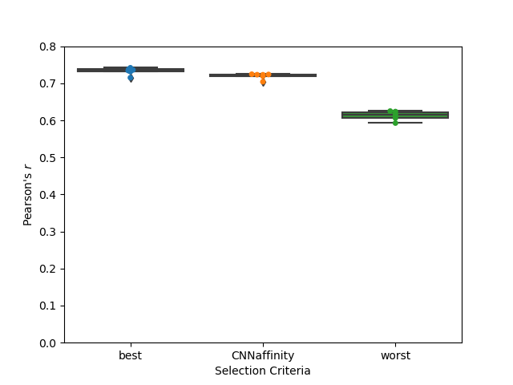

# GNINA Scoring Function for PDBbind

Application test with the goal of reproducing some results from Francoeur *et al.* (J. Chem. Inf. Model. 2020, 60, 4200-4215). This application test trains the `default2018` model for binding affinity prediction on the PDBbind refined set (Crystal) and test it on the PDBbind core set (Docked) in ordert to reproduce part of Fig. 2.

## Data

The data is obtained from [bits.csb.pitt.edu/files/crossdock2020/](https://bits.csb.pitt.edu/files/crossdock2020/). The following archives are needed:
* `PDBbind2016.tar.gz`: contains the PDBbind structures (in `.gninatypes` format)
* `v1.0/paper_types.tar.gz`: contains the `.types` files with pose annotations and affinities

The data can be downloaded automatically using the `00_download.sh` script in the `Francoeur2020` folder.

## Training

Training is performed for 750 "small" epoch, where a "small" epoch is defined as the number of iterations at which examples have been sampled at least once. (Note: the number of epochs differs from the number of iterations from Francoeur *et al.*)

The training set is defined by the following `.types` file: `ref2_crystal_train0.types`. Six models are trained starting from different random seeds.

Notable differences in the training procedure are the following:
* pseudo-Huber loss as affinity loss (instead of standard L2 loss)
* no parameter `scale` for the affinity loss

Training is not balanced nor stratified since there is only one pose per system in this dataset and all are good poses.

## Evaluation

The model trained on crystal poses is evaluated on the poses of the following `.types` file: `ref_uff_test0.types`. One pose per system is selected using different methods: lowers RMSD ("best"), highest RMSD ("worst"), and highest predicted affinity ("CNNaffinity"). The Pearson's correlation coefficient and the RMSE are computed for the selected poses

This reproduces parst of Fig. 2 of Francoeur *et al.*. Difference might be attributed to the differences in the affinity loss function described above as well as other implementation details.

## Citations

> Three-Dimensional Convolutional Neural Networks and a CrossDocked Data Set for Structure-Based Drug Design,
> P. G. Francoeur, T. Masuda, J. Sunseri, A. Jia, R. B. Iovanisci, I. Snyder, and D. R. Koes, *J. Chem. Inf. Model.* 2020, 60 (9), 4200-4215.
> DOI: [10.1021/acs.jcim.6b00740](https://pubs.acs.org/doi/full/10.1021/acs.jcim.6b00740)
