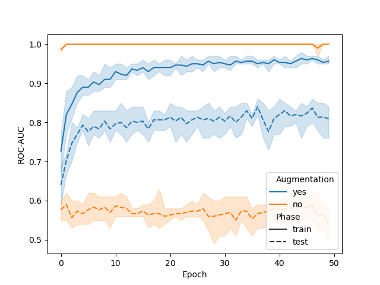

# GNINA Scoring Function for CASF Dataset

Application test with the goal of reproducing some results from Ragoza et al. (J. Chem. Inf. Model. 2017, 57, 942−957). This application tests allow to compute the ROC AUC as a function of the number of epochs with and without data augmentation in order to reproduce Fig. 3.

## Data

The data is obtained directly from the [gnina/models](https://github.com/gnina/models) repository and consists of docked poses from the [CSAR](http://csardock.org/) dataset

The data can be downloaded automatically using the `00_download.sh` script.

## Training

Training is performed with data agumentation by default (uniform random rotations and random translations up to 6A in each direction) but can be turned off with the following options:
```text
--random_translation 0.0
--no_random_rotation
```

Training is performed for 50 "small" epoch, where a "small" epoch is defined as the number of iterations at which examples have been sampled at least once. (Note: the number of epochs differs from the number of iterations from Ragoza *et al.*)

## Evaluation

The ROC-AUC metric is reported in function of the number of training epochs with and without data augmentation.



This reproduces Fig. 3 of Ragoza *et al.* The difference between the two figures is that in the original implementation the number of iterations is reported, while here we report the number of "small" epochs (where a "small" epoch ends when system have sampled at most once).
## Citations

> Protein–Ligand Scoring with Convolutional Neural Networks,
> M. Ragoza, J. Hochuli, E. Idrobo, J. Sunseri, and D. R. Koes, *J. Chem. Inf. Model.* 2017, 57 (4), 942-957.
> DOI: [10.1021/acs.jcim.6b00740](https://pubs.acs.org/doi/full/10.1021/acs.jcim.6b00740)
